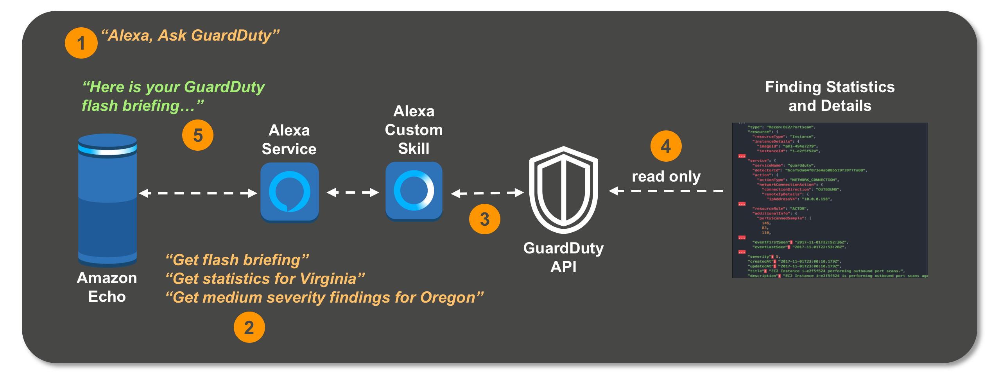

# Sample Alexa GuardDuty Skill

Introduced at AWS re:Invent 2017, Amazon GuardDuty is a managed threat detection service that continuously monitors for malicious or unauthorized activity to help you protect your AWS accounts and workloads. In this AWS Blog post, Jeff Barr demonstrates how to enable GuardDuty to start monitoring your AWS resources in a single AWS account and describes various GuardDuty features. The follow up AWS Blog post describes how to manage GuardDuty findings across multiple AWS accounts. You may also find it valuable to use Amazon Alexa as a conversational interface to easily obtain information about GuardDuty statistics and findings.

Amazon GuardDuty generates findings when it detects unexpected and potentially malicious activity in your AWS environment. You can view and manage your GuardDuty findings on the Findings page in the GuardDuty console or by using the GuardDuty CLI or API operations. In this blog post, I will describe how to use Amazon Alexa as a conversational interface to quickly and easily review your GuardDuty findings.

Alexa is Amazon's cloud-based voice service that is supported on tens of millions of Amazon and other third-party devices. With Alexa, you can build natural voice experiences and a more intuitive way of interacting with the technologies that you use every day.

In this blog post, I will show you how to deploy a sample custom Alexa skill and use an Alexa-enabled device, such as Amazon Echo to obtain information about GuardDuty findings across your AWS accounts and regions. This will enable you to quickly understand current GuardDuty finding statistics and details through the Alexa voice interface. The information provided by this sample skill is intended to give you a broad overview of GuardDuty finding statistics, severities and descriptions. With this information, you may wish to log into the GuardDuty console or another analysis tool to drill further into the findings data.

Before completing the steps for deploying the sample Alexa skill, make sure to confirm your security policies and guidelines. Although the Alexa skill you deploy will not be publically available, any access to an Alexa enabled device should conform to your security requirements.

Note: Although not covered in this blog post, you can also deploy this sample skill using Alexa for Business. Introduced at AWS re:Invent 2017, Alexa for Business allows organizations of all sizes to introduce Alexa to their workplace. With Alexa for Business, you can use the Alexa you know as an intelligent assistant to stay organized and focus on the work that matters. With Alexa for Business you can make skills available to your shared devices and enrolled users without having to publish them to the Alexa skills store.

Note: A basic understanding of Alexa Custom Skills is helpful for deploying the sample skill described in this blog post. If you are not already familiar with Alexa custom skill concepts and terminology, you may want to review the following documentation resources.

Solution overview
The solution diagram below is followed by a description of the flow of events. The CloudFormation template creates the Lambda function for the sample Alexa skill.

## Skill Diagram

Here is how the solution works, as shown in the preceding numbered diagram:
1.	The user opens the skill; "Alexa, ask GuardDuty" or "Alexa, open GuardDuty".
2.	After opening the skill, the user states a supported intent, such as "Get flash briefing."
3.	The Alexa service passes the intent and the custom skill uses the Lambda function to call the GuardDuty API and request the information.
4.	The GuardDuty service returns the requested information and the Lambda function returns the response to the Alexa service.
5.	The Alexa service delivers the audio response via the Alexa-enabled device.

Prerequisites
In order to complete the steps in this blog post, make sure you have the following prerequisites:
1.	An AWS account with GuardDuty enabled in one or more AWS regions.
2.	An Alexa-enabled device, such as an Amazon Echo.
3.	An Amazon Developer Account.
4.	(Optional) An AWS account configured with Alexa for Business.

## Features
- Multi-Region support
- DetectorId auto discovery
- "Ask GuardDuty to get Flash Briefing" powered by get_findings_statistics. Uses an environment variable with comma separated region ids.
- Response provides high / med / low severity labels
- instance id / ip redaction
- help
- Error detection for disabled / regions not configured
- CloudFormation deployment for Lambda component

## Intent examples
- *Open GuardDuty*
- *Ask GuardDuty to get Flash Briefing*
- *Get statistics for Virginia*
- *Get high severity findings for Oregon*
- *help*

## Variables
**MAXRESP = os.environ['MAXRESP']**

Max number of findings to return. Although 50 can be returned without paginating,
keeping this below 15 is a good idea to avoid Alexa size limit and general sanity preservation.

**FLASHREGIONS = os.environ['FLASHREGIONS']**

Comma separated list of region codes with NO spaces to include in flash briefing stats.
***Make sure GuardDuty is enabled in regions declared***

## Deployment into Personal Dev Account

1. Deploy CloudFormation Template.
2.  Go to [Amazon Dev Console](https://developer.amazon.com/alexa/console)
3. Paste Skill JSON into Skill Builder Code Editor in **Interaction Model**. Save / Build
4. Get Outputs: AlexaAskGDSkillArn from stack and paste into Lambda endpoint field in skill **Configuration**
5. Do not complete the final 2 skill configuration sections; Publishing Information and Privacy and Compliance.
6. Test with Alexa-enabled device.

***[Alexa for Business Deployment](https://aws.amazon.com/alexaforbusiness/getting-started/)***

## License

This library is licensed under the Apache 2.0 License.
